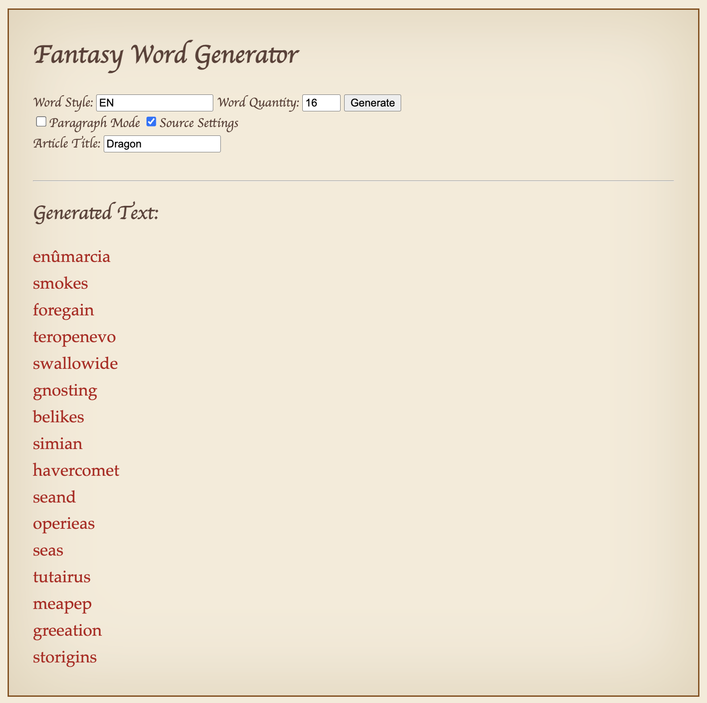

# FantasyWordForge [fantasywordforge.github.io]
FantasyWordForge is a website that allows you to generate your own fantasy names. These names can be inspired by any language of your choice!
This website uses and is the official demo for the FantasyWordGenerator library by [EpicAMPlifier](https://github.com/EpicAMPlifier). 
<br><br>

<div>
  
</div>
<br>

# TEST IT OUT!
Try the generator instantly in your browser at:<br>
https://fantasywordforge.github.io/.<br><br>

**Examples:** <br>
Input: ```Dragon```, ```EN```. <br>
Output: ```levolevia```, ```atureas```, ```beneas```, ```amduas```, ```resun```, ```adrieurite```, ```tutairus```.<br><br>
Input: ```Eldstöð``` (Icelandic for volcano), ```IS```. <br>
Output: ```hawaitað```, ```vatnsgufur```, ```gjóskugosi```, ```dreinum```, ```hraum```, ```yfist```.
<br><br>

# USE CASES:
- Fantasy character and place names
- Worldbuilding and writing
- Game development
- Procedural content generation
<br>
<hr>
